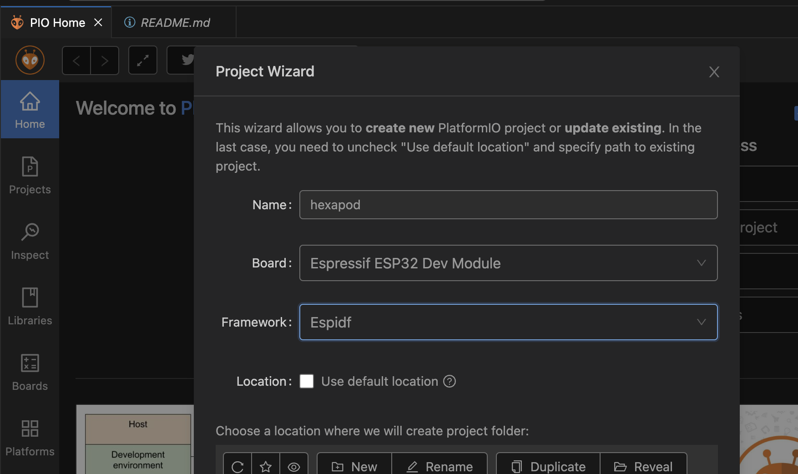

# Hexapod-42

## 3D printing with Bambu Printer Steps

1. Open BambuStudio (Link to the official Bambu introduction documents)
2. Drag / Drop: .stl files to BambuStudio
3. Turn & orient pieces so biggest surface area is on bottom and no overhangs is possible
4. Click: “Prepare” (this will perfectly arrange the distance between pieces and similar surface levels)
5. Optional: Adjust strength pattern 
6. Print plate (double check for right printer)

## Setting up Workspace in VSCode

1. Open VSCode
2. Install PlatformIO Plugin 
3. Create new Project 

4. Add dependencies 
5. Add test program in main.c
6. Click: build icon 
7. 

